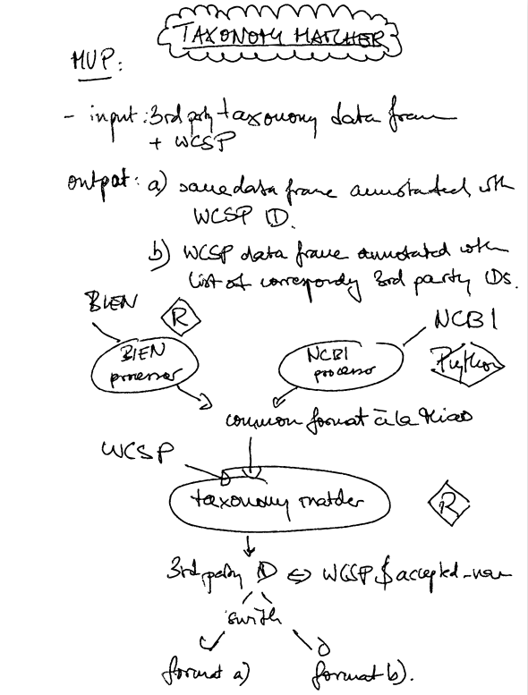
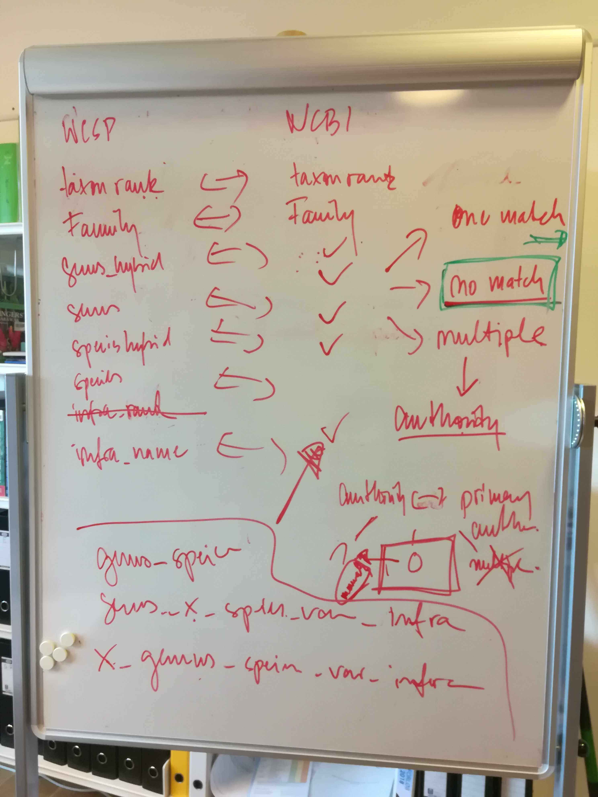
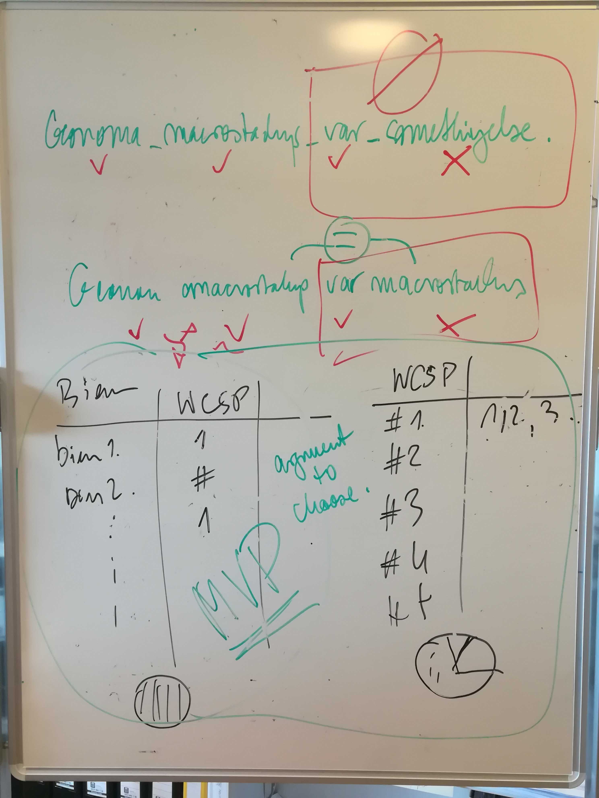

# Taxonomic_Matcher

Store some scripts and results from matching NCBI and WCSP taxonomies  

**Note:**  

   + The data folder is not yet uploaded given the size > 1 GB.  
   
    `3.9G Feb 12 16:30 Spermatophyta_plnDB_02012020.txt`  
    
  + The python script is developed in Python3 enviroment.  

## General Workingflow

  

**These steps showing how to get final clean data**

**Step 1: Run `ncbi_name_extract_V3.py`**  

  + This script will take the database of the [plant division from NCBI](https://www.ncbi.nlm.nih.gov/genbank/htgs/divisions/) (e.g., "plnDB20191101.db" generated by [phlawd db maker](https://github.com/blackrim/phlawd_db_maker) )    
  + Then use SQL to extract my columns interested taxon group ("tid") and columns from the database  
    `sqlcmd = "SELECT ncbi_id,parent_ncbi_id,name,node_rank FROM taxonomy WHERE name_class ='scientific name' OR name_class = 'authority'"`  
  + Output file name: _"Spermatophyta_plnDB_02012020.txt"_  
    
**Step 2: Run `remove_duplicate.py`**     

  + Remove duplicated records reduce the data size  
  
  + Output file name: _"Spermatophyta58024_plnDB02032020_nodupl.csv"_  
  
**Step 3: Run `Spermatophyta_plnDB_cleanerV1.1.sh`**   

  + Run bash script to further reduce some _"unwanted"_ records (also see scripts inside comments for details):  
  
    #subfamily  
    #subgenus  
    #suborder  
    #subsection  
    #subtribe  
    #tribe  
    #cf.  
    #aff.  
    #environmental  
    #unclassified_  
    #_incertae_sedis  
    #_clade  
    #_superclade  
    #_Group  
    #_group  
    #_complex  
    #_(type_*)  
    #_lineages  
    #C3_  
    #C4_  
    #_sensu_lato  
    #_samples  
    #_alliance  
    #_division  
    #_hybrid_  
    #_cultivar  
    #_subgroup  
    #_form  
    #ungrouped_  
    #unpublished_   
    
  + Output file name: _"Spermatophyta58024_plnDB02032020_nodupl_bashcleaned.csv"_  

**Step 4: Run `Spermatophyta_sp_authority_format_v4.py`**   

  This script will reformat the NCBI taxonomy file, mainly split taxon Authority into a different column, and correct the taxon status (for examples a _"varietas"_ assigned to  _"species"_).  
  
  It also generates 4 output files:  
  
  + **The main reformated file**  
    _Spermatophyta58024_plnDB_pyphlawd02172020_reformated.csv_  
    
  + Those cultivars  
    _Spermatophyta58024_plnDB_pyphlawd02172020_cultivar.csv_  
    
  + Those hybrids
    _Spermatophyta58024_plnDB_pyphlawd02172020_ill.hybrids.csv_  
    
  + Those "genus_sp." cases  
      _Spermatophyta58024_plnDB_pyphlawd02172020_sp.csv_
    
  
**Step 5: Run `Spermatophyta_clean3.14snakeV3.py`**   
 
  + This script will parsing the NCBI taxonomic information as `order,family,genus_hybrid,genus,species_hybrid,species,infraspecific_rank,infraspecies,taxon_authority,taxon_rank,ncbi_id` , to preparing for matching with the taxonomy database from [World Checklist of Selected Plant Families (WCSP)](https://wcsp.science.kew.org/home.do).  
  
  + This script also calculate species count under each _genus, family, and order_ providing information for the strategy of future supertree reconstruction.  
  
  + It also generate 3 output files:  
  
    - **The main file**  
      _Spermatophyta_clean02172020.csv_  
      
    - The file for those genus without species records under  
      _Spermatophyta_Nospecies_NCBI.csv_  
      
    - **The table which calculate species richness under each genus**  
      _Spermatophyta_Richness_NCBI.csv_  

**_(To be continued ...)_**  

**External link**

[Phylosynth](https://github.com/phylosynth)  

[BIEN taxonomy match](https://github.com/pebgroup/taxonomy_matcher)  

Last update:  

_Mon Feb 17 14:42:32 2020_  

