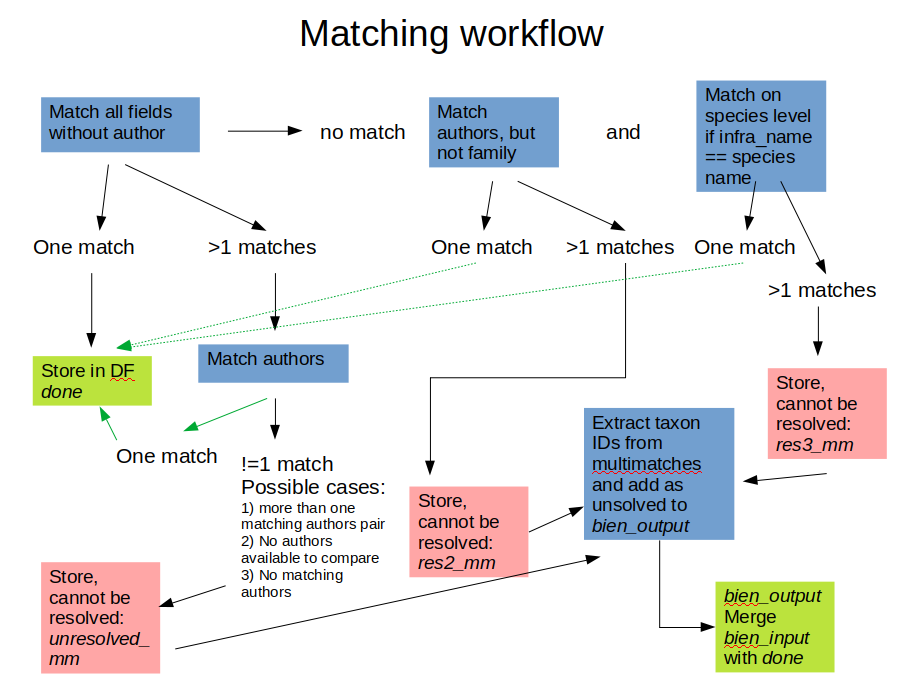
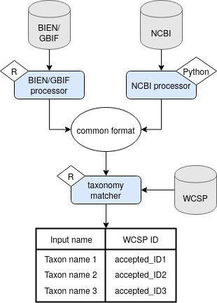

---
# Resolving taxon names from BIEN and NCBI with WCSP
---

## Script information  

**BIEN dataset reformat script (_R_)**  

    _BIEN_taxonomy/common_format_creator_vectorized.R_  

**NCBI dataset reformat scripts (_Python_)**  

    _NCBI_taxonomy/scripts/ncbi_name_extract_V3.py_  
    _NCBI_taxonomy/scripts/remove_duplicate.py_  
    _NCBI_taxonomy/scripts/Spermatophyta_clean3.14snakeV3.py_  
    _NCBI_taxonomy/scripts/Spermatophyta_plnDB_cleanerV1.1.sh_  
    _NCBI_taxonomy/scripts/Spermatophyta_sp_authority_format_V5.py_  
    
**Taxon merger (_R_)**      

    taxonomic_matcherV1.2_MT.R  
  
## Documentation  

For documentation on the scripts creating the common format, please refer to the corresponding markdown file:  

	+ *[BIEN_common_format_documentation](BIEN_common_format_documentation.md)*

	+ *[NCBI_common_format_documentation](/NCBI_taxonomy/README.md)*

For documentation on the actual tacon merging procedure, see section [Taxon matching logic](## Taxon matching logic)

<!--
**Taxonomic matching**  

*taxonomic_matcherV1.2_MT.R* performs the matching of the selected common format resulting from BIEN or NCBI data with the [World Checklist of Selected Plant Families (WCSP)](https://wcsp.science.kew.org/home.do).

##   Workflow for taxon matching logic
 -->

## Workflow  
<!-- 
A text that serves as general documentation of the matching prodecure that can be used e.g. in a supplement.
-->

### Summary
In order to combine species occurrence and molecular data from databases that follow different taxonomy guidelines, we developed a taxonomy matching procedure that resolves taxon names according to their accepted name in the World Checklist for Selected Plant Families (WCSP) [1], which serves as our reference taxonomy. We used the WCSP to standardize taxon names from 1) the Botanical Ecology and Information Network (BIEN) database [2], and 2) from the molecular database by the National Center for Biotechnology Information (NCBI) [3].
Taxon names in BIEN database follow the taxonomy provided by the Taxonomic Name Resolution Service (TNRS) [4], NCBI taxon names follow ???.

Complete taxon names from BIEN or NCBI were split into their components and filled into a common format dataframe to unify names format. We extracted the following fields from taxon names: family, author, generic name, genus hybrid, species epiphet, species hybrid, taxon rank, infraspecific name. In case of missing information, NAs were introduced. Genus or species hybrids were marked with an "x" in the respective column.

### BIEN processor
Required data from the BIEN database include columns *scrubbed_taxon_name_no_author*, *scrubbed_family* and *scrubbed_scrubbed_author*. The BIEN processor script splits taxon names into their components, using space as a separator. According to the number of strings that were retrieved from a single taxon name, a certain set of regular expressions-conditions where applied the name, assigning each part of the name to its corresponding column in the common format dataframe. The set of conditions differs according to the number of strings retrieved from a taxon name. Conditions used where the position of an "x" (hybrid marker), the position of string starting with a capital letter, and combinations of both conditions. For a list of all conditions with all possible taxon name cases, see the *[BIEN_common_format_documentation](BIEN_common_format_documentation.md)* and [R script](common_format_creator_vectorized.R). 

### NCBI processor
 NCBI common format documentation link [here](/NCBI_taxonomy/README.md)

## Taxon matching logic
To prepare the WCSP data for matching, we combined the columns *infraspecific_rank* and *taxon_rank*, then shrank the dataset to the same columns present in the input dataset plus a column with the accepted plant name ID.

In the first step, a left join (keeping all rows from the input dataframe) of the input dataset with the relevant WCSP dataframe is performed, using all columns for matching except for author names. Author names are rather prone to spelling or punctuation errors, which is why they were excluded in this step. Taxon names with one matching accepted plant name ID were stored as resolved. For cases with more than one match we included the author names in another left join. Cases which could be resolved by using the author name were added as resolved, cases with multiple matches were conservatively considered as unmatchable. For cases with no initial matches, we applied two more matching steps: 1) for taxon names with ranks below the species level and identical species and infraspecific names, we performed a left join without using the taxonomic rank and the infraspecific name for matching. For the remaining cases with no initial match, we 2) matched both dataframes using all fields except for family. As before, single and multiple matches were added to the respective dataframes. Our output is a table including all initially entered taxon names, the type of match (or NA), and the corresponding accepted plant name ID (or NA).

See figure XX for a graphical presentation of the procedure.

# References

[1] WCSP (2020). 'World Checklist of Selected Plant Families. Facilitated by the Royal Botanic Gardens, Kew. Published on the Internet; http://wcsp.science.kew.org/ Retrieved 15 December 2019.' 

[2] Botanical Information and Ecology Network (https://bien.nceas.ucsb.edu/bien/)

[3] [NCBI website](https://www.ncbi.nlm.nih.gov/)  

[4] Boyle, B. et.al. The taxonomic name resolution service: an online tool for automated standardization of plant names. BMC Bioinformatics. 2013, 14:16. doi:10.1186/1471-2105-14-16

