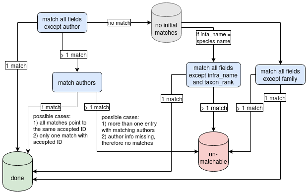

---
# Resolving taxon names from BIEN, GBIF and NCBI with WCVP
---

## Scripts 

**BIEN/GBIF data set reformat script (_R_)**  
See [BIEN/GBIF
documentation](/BIEN_taxonomy/BIEN_common_format_documentation.md) for details.

    BIEN_taxonomy/common_format_creator_vectorized.R 

**NCBI data set reformat scripts (_Bash & Python_)**  
See [NCBI documentation](/NCBI_taxonomy/README.md) for details.

    NCBI_taxonomy/scripts/ncbi_name_extract_V3.py  
    NCBI_taxonomy/scripts/remove_duplicate.py  
    NCBI_taxonomy/scripts/Spermatophyta_clean3.14snakeV3.py  
    NCBI_taxonomy/scripts/Spermatophyta_plnDB_cleanerV1.1.sh  
    NCBI_taxonomy/scripts/Spermatophyta_sp_authority_format_V5.py  
    
**Taxon merger (_R_)**    
See section [Taxon matching logic](#taxon-matching-logic) for details.

    taxonomic_matcher.v.1.4.R   

## Data
We do not supply data here, but scripts to document taxon matching logic. All 
data can be obtained from the described online resources.

## Summary
We resolve taxon names according to their accepted name in the World Checklist
for Vascular Plant Families (WCVP)[1], which serves as our reference
taxonomy, in order to combine species data from databases that follow different
taxonomy guidelines. We standardize taxon names from three databases:

+ The Botanical Ecology and Information Network
([BIEN](https://biendata.org/))[2]
	
+ The molecular database by the National Center for Biotechnology Information ([NCBI](https://www.ncbi.nlm.nih.gov/))[3]  

+ Global Biodiversity Information Facility
([GBIF](https://www.gbif.org/))[4]

Taxon names in BIEN database follow the taxonomy provided by the Taxonomic Name
Resolution Service (TNRS)[5], NCBI taxon names follow APG
IV[6] (also see [APWeb](http://www.mobot.org/MOBOT/research/APweb/)).

Complete scientific taxon names from BIEN, GBIF or NCBI were split into their
components and filled into a common format data frame. We extracted the
following fields from taxon names: family, author, generic name, genus hybrid,
species epiphet, species hybrid, taxon rank, infraspecific name. In case of
missing information, NAs were introduced. Genus or species hybrids were marked
with an "x" in the respective column.

  

  

### BIEN/GBIF processor
Required data from the BIEN database include columns
*scrubbed_taxon_name_no_author*, *scrubbed_family* and
*scrubbed_scrubbed_author*. The processor script splits taxon names into their
components, using space as a separator. According to the number of strings that
were retrieved from a single taxon name, a certain set of regular
expressions-conditions where applied the name, assigning each part of the name
to its corresponding column in the common format data  frame. The set of
conditions differs according to the number of strings retrieved from a taxon
name. Conditions used where the position of an "x" (hybrid marker), the position
of string starting with a capital letter, and combinations of both conditions.

GBIF processing includes an extra step that separates author names from
scientific taxon names.

_For a list of all conditions with all possible taxon name cases, see the documentation [here](/BIEN_taxonomy/BIEN_common_format_documentation.md)_

### NCBI processor  
Briefly, we used `ncbi_name_extract_V3.py` to extract NCBI taxonomy from NCBI
database (generated by [phlawd db
maker](https://github.com/blackrim/phlawd_db_maker)) based on insterested
columns (e.g., "ncbi_id", "parent_ncbi_id", "scientific_name");
`remove_duplicate.py` is emplyed to remove those duplicated entries, and the
taxonomy is further cleaned by `Spermatophyta_plnDB_cleanerV1.1.sh`, then pass
to `Spermatophyta_sp_authority_format_v4.py`, which mainly splits taxon
authority into a seperated column, and correct the taxon status; and lastly
`Spermatophyta_clean3.14snakeV3.py` is used to proccess all those name strings
based on taxonic information categories (e.g., order, family,
genus_hybrid,genus, species_hybrid, species, infraspecific_rank, infraspecies,
taxon_authority, taxon_rank, ncbi_id) match with format of the taxonomy database
from [World Checklist of Selected Plant Families
(WCVP)](https://wcsp.science.kew.org/home.do).

_For more detailed NCBI common format documentation click [here](/NCBI_taxonomy/README.md)_  

## Taxon matching logic
Matching phylogeny tip labels with WCVP taxa was done using exact string
matching of the taxonomic information in subsequent steps. Fields for matching
used are: taxon name, author name, genus hybrid indicator, species hybrid
indicator, genus name, species name, taxon rank, infraspecific name. Prior to
running the matching, family names in all datasets were corrected for the latest
accepted version based on the APG IV system [6].

The three major steps in matching process are: 

1. Matching WCVP with common input format (left join) using all columns except
author name. Author names were excluded in this first step since they are
notoriously prone to faulty spelling or punctuation. 
  + Taxa with exactly one
matching WCVP entry were considered resolved and removed from further steps. 
  + Taxa with >1 matching WCVP entries were matched again, this time using all
columns including author names. Taxa with one match were stored as resolved,
taxa with multiple matches were conservatively considered  unmatchable since no
additional information is available for further comparison.

2. Taxa with no matches in step 1 were matched again, this time excluding
taxonomic rank and infraspecific name. Single matches were marked as solved,
multiple matches were further resolved if possible (e.g. if pointing to the same
accepted plant name ID), else treated as unmatchable.

3. Remaining taxa were matched using all columns except family. The most common
source for family mismatch was missing entries, hence we added this option.
Single matches were marked as solved, multiple matches per taxon treated as
unsolvable.

The output is a table including all initially entered taxon names, the type of
match, and the corresponding `accepted_plant_name_ID`.

See figure XX for a graphical presentation of the procedure.

  

  

## References  

[1] R. Govaerts, E. Nic Lughadha, N. Black, R. Turner, A. Paton, The World
Checklist of Vascular Plants, a continuously updated resource for exploring
global plant diversity. Scientific Data 8, 1–10 (2021). Retrieved July 2021.'

[2] Botanical Information and Ecology Network
(https://bien.nceas.ucsb.edu/bien/)

[3] NCBI website: https://www.ncbi.nlm.nih.gov/  

[4] GBIF.org, “GBIF Home Page”, 2020.

[5] Boyle, B. et.al. The taxonomic name resolution service: an online tool for
automated standardization of plant names. BMC Bioinformatics. 2013, 14:16.
doi:10.1186/1471-2105-14-16

[6] APG IV. An update of the Angiosperm Phylogeny Group classification for the orders and families of flowering plants: APG IV. Botanical Journal of the Linnean Society, 2016, 181, 1–20. [Link](https://academic.oup.com/botlinnean/article/181/1/1/2416499)  

